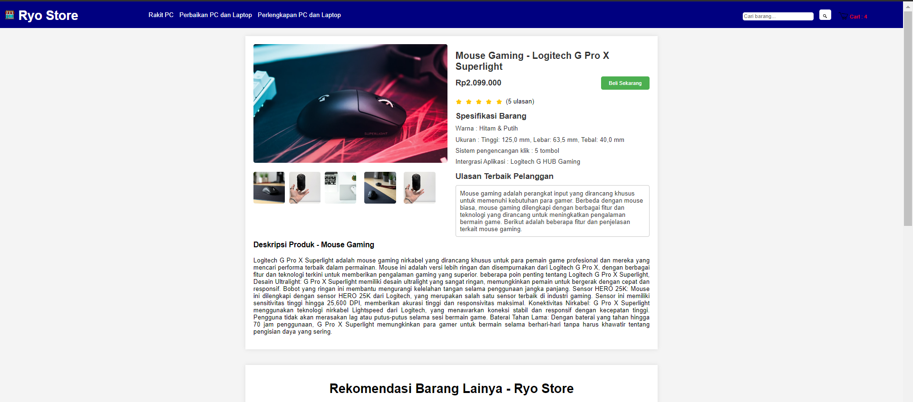
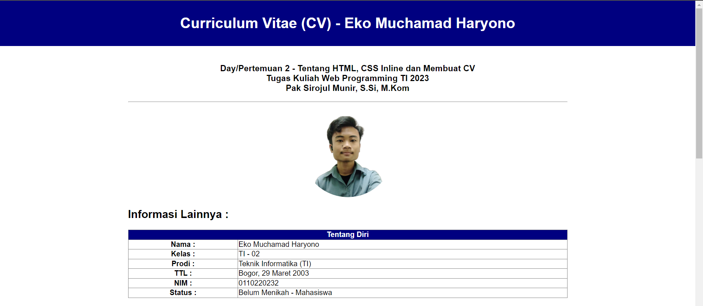

### Tugas Praktikum 02 - Pemograman Web 1

<b>Nama : </b>Eko Muchamad Haryono  
<b>Kelas : </b>TI - 02  
<b>Prodi : </b>Teknik Informatika  
<b>Dealine </b>Tugas : 03 Oktober 2023 ==>> 17 Oktober 2023  
<b>Mata Kuliah : </b>Pemograman Web 1 (PW1)  

<h3>Penjelasan Tugas </h3> 

<b>Pengumpulan - Tugas Utama : (Sudah Selesai)</b>
1. Membuat Website Yang Menampilkan Produk Sesuai Dengan Topik Penjualan Menggunakan, HTML dan CSS Inline Yang Mencakup :
   
   Step Pengerjaan :

   - judul dan navigasi.
   - bagian keranjang belanja isi nya judul produk, harga, gambar, dll
   - bagian deskripsi produk

<b>Pengumpulan Sub Tugas : (Sudah Selasai)</b>

2. Sub Tugas = Boleh Melampirkan  CV Bersamaan Dengan Tugas Produk -> Namun Tugas Produk Yang Tetap Menjadi Tugas Utama

<h3>Informasi Lokasi Tugas : </h3>
Lokasi Praktikum 02 = Directory Repo =<a href="https://github.com/ekomh170/Tugas_Praktikum_Web_PW1/tree/ry_dev/Praktikum_02">Praktikum_02/</a>

1. <b>Tugas Utama</b> = Directory Repo : <b><a href="https://github.com/ekomh170/Tugas_Praktikum_Web_PW1/blob/ry_dev/Praktikum_02/produk1_0110223079_ekomuchamadharyono.html">Praktikum_02/produk1_0110223079_ekomuchamadharyono.html</b></a>
  
2. <b>Sub Tugas</b> = Directory Repo : <b><a href="https://github.com/ekomh170/Tugas_Praktikum_Web_PW1/blob/ry_dev/Praktikum_02/cv_0110223079_ekomuchamadharyono.html">Praktikum_02/cv_0110223079_ekomuchamadharyono.html</a></b>

<h3>Hasil Preview Tugas : </h3>

1. Tugas Utama = Tampilan Produk 

2. Sub Tugas = Tampilan CV

<h3>Inspirasi : </h3>

1. IMG - Gambar/Foto Pada Web :  https://unsplash.com/
2. Favicon  : https://ais.nurulfikri.ac.id/ &  https://elena.nurulfikri.ac.id/
3. ICO - Logo : https://www.flaticon.com/free-icons/store