### Repo - Tugas Praktikum Web - Pemograman Web 1 - Pada Setiap Praktium

<b>Nama : </b>Eko Muchamad Haryono  
<b>Kelas : </b>TI - 02  
<b>Prodi : </b>Teknik Informatika  
<b>Mata Kuliah : </b>Pemograman Web 1 (PW1)  

<h3>Praktikum Pemograman Web 01 (PW1) Tugas :</h3> 

<b>1. Nama Folder : Praktikum_02 </b>

Lokasi Praktikum 02 = Directory Repo =<a href="https://github.com/ekomh170/Tugas_Praktikum_Web_PW1/tree/ry_dev/Praktikum_02">Praktikum_02/</a>
   - Produk == (Tugas Utama)
   

   - CV (curriculum vitae) == (Sub Tugas)
    

 

<b>2. Nama Folder : Praktikum_03</b>

Lokasi Praktikum 03 = Directory Repo =<a href="https://github.com/ekomh170/Tugas_Praktikum_Web_PW1/tree/ry_dev/Praktikum_03">Praktikum_03/</a>
   - Form Pemesanan Barang dan Hasil Pemesanan Barang/Produk (Tugas Utama) =  Lokasi = <a href="https://github.com/ekomh170/Tugas_Praktikum_Web_PW1/tree/ry_dev/Praktikum_03/form_produk">Praktikum_03/form_produk/</a>
      
      1. Form : 
      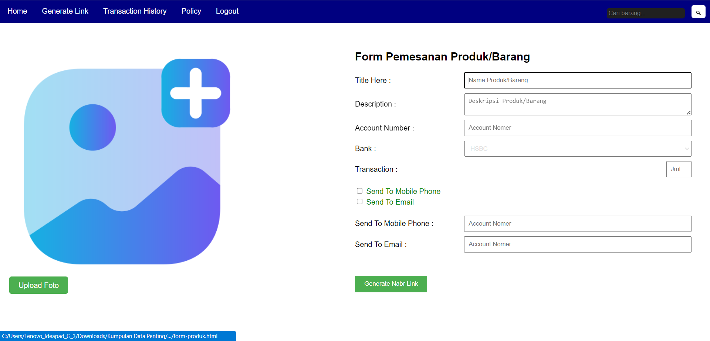 

      2. Hasil : 
      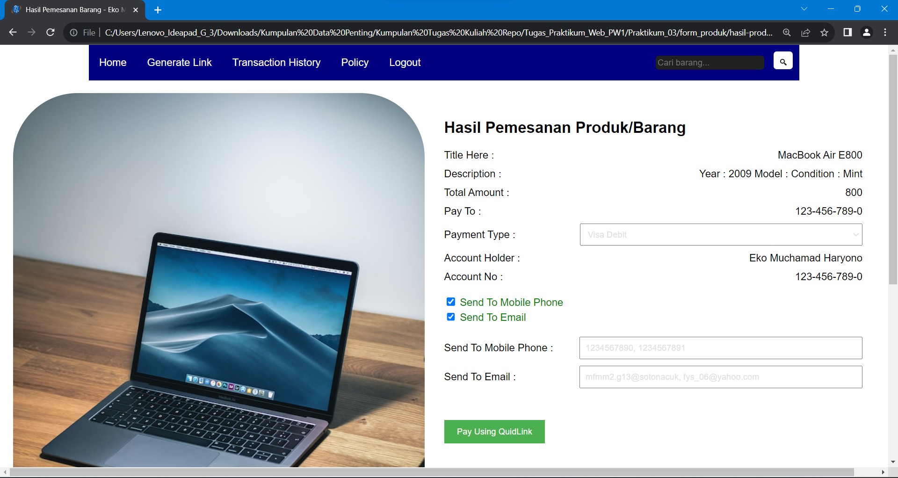 

   - Form Pizza (Sub Tugas) = Lokasi = <a href="https://github.com/ekomh170/Tugas_Praktikum_Web_PW1/tree/ry_dev/Praktikum_03/form_pizza">Praktikum_03/form_pizza/</a>
   
      1. Form :
      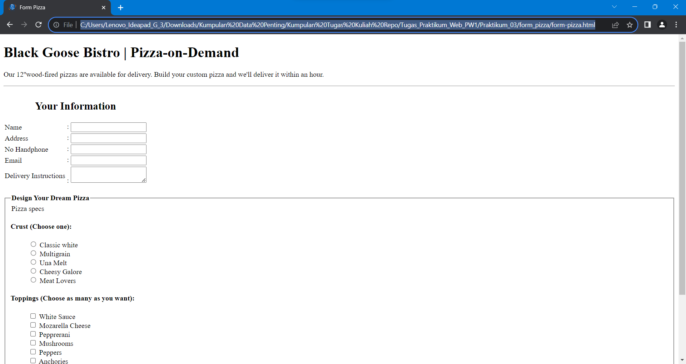

      2. Hasil :
      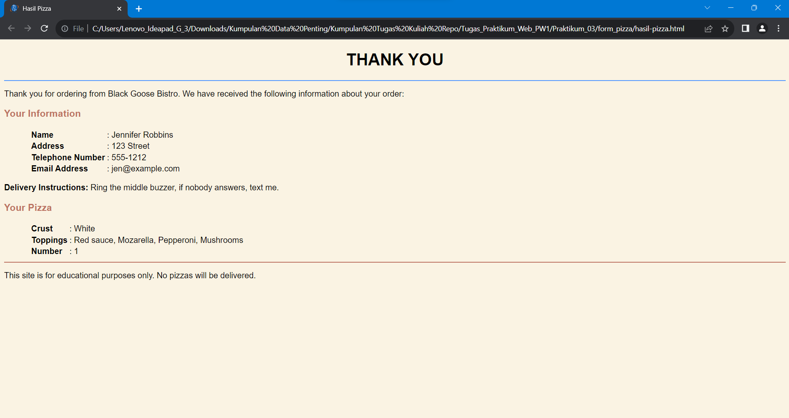
      

   - Form (Sub Tugas/Latihan) = Lokasi = Lokasi = <a href="https://github.com/ekomh170/Tugas_Praktikum_Web_PW1/tree/ry_dev/Praktikum_03/form">Praktikum_03/form/</a>

      1. Form :
      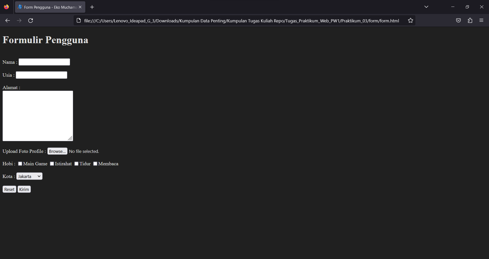

      2. Hasil :
      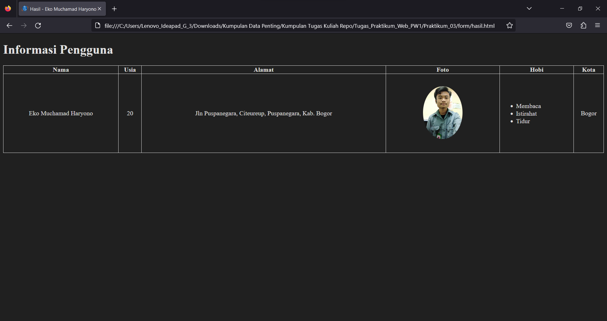 

<b>4. Nama Folder : Praktikum_04 :</b>

<h3>Tugas Utama Praktikum 4 : </h3>

Lokasi Praktikum 04 = Directory Repo =<a href="https://github.com/ekomh170/Tugas_Praktikum_Web_PW1/tree/ry_dev/Praktikum_04">Praktikum_04/</a>

- Praktikum 4 | Membuat Halaman Web Profile | Gambar 4.3 = Lokasi = <a href="https://github.com/ekomh170/Tugas_Praktikum_Web_PW1/tree/ry_dev/Praktikum_04/profile_tugas_utama">Praktikum_04/profile_tugas_utama/</a>

1. Hasil Output Tugas : 
 
      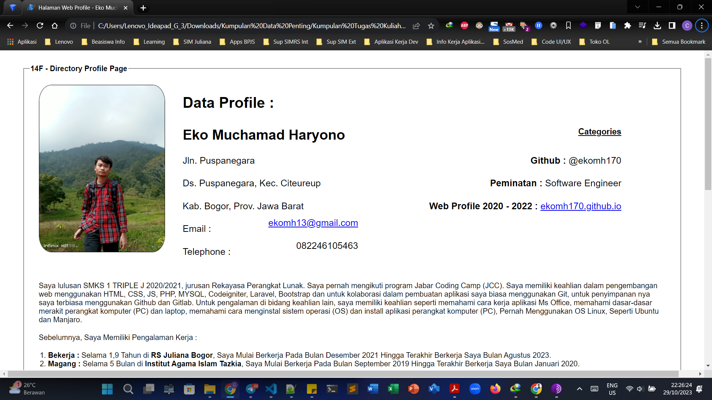 

      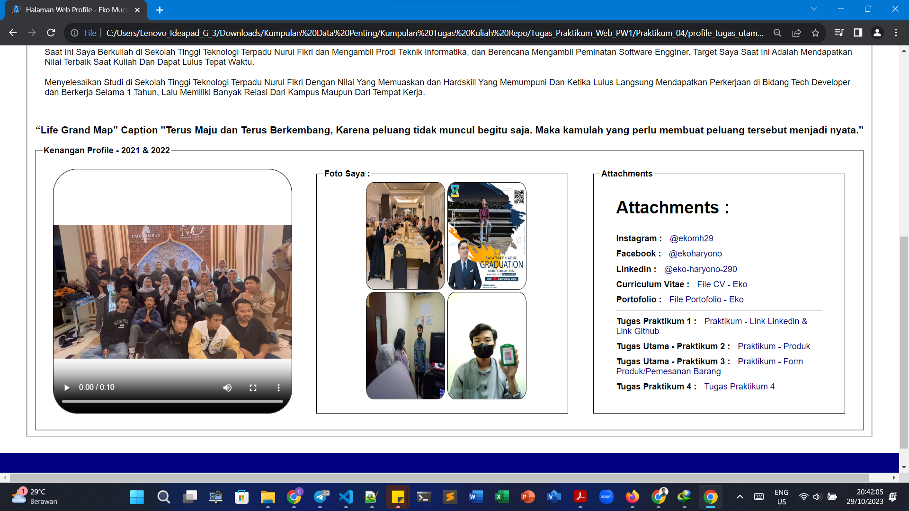 

<h3>Sub Utama Praktikum 4 : </h3>

Sub Tugas Hanya - Melampirkan Lokasi Tugas :

- Praktikum 4 | Sub Tugas - Layout Halaman Web dengan IFRAME |  Gambar 4.1 = Lokasi = <a href="https://github.com/ekomh170/Tugas_Praktikum_Web_PW1/tree/ry_dev/Praktikum_04/web_layout_iframe">Praktikum_04/web_layout_iframe/</a>

- Praktikum 4 | Sub Tugas - HTML5 Layout |  Gambar 4.2 = Lokasi = <a href="">Praktikum_04/web_layout_html5/</a>

<b>5. Nama Folder : Praktikum_07 :</b>

<h3>Tugas Utama Praktikum 7 : </h3>

Lokasi Praktikum 07 = Directory Repo =<a href="https://github.com/ekomh170/Tugas_Praktikum_Web_PW1/tree/ry_dev/Praktikum_07/">Praktikum_07/</a>

- Praktikum 7 | Tugas Buat HTML dan Terapkan CSS box dan Positioning Untuk Membuat Halaman Web  | Gambar 7.3 = Lokasi = <a href="https://github.com/ekomh170/Tugas_Praktikum_Web_PW1/tree/ry_dev/Praktikum_07/tugas_praktikum_7">Praktikum_07/tugas_praktikum_7/</a>
  
1. Hasil Output Tugas : 
 
      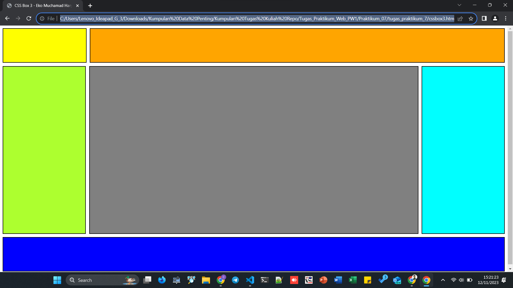 

<b>6. Nama Folder : Praktikum_08 :</b>

<h3>Tugas Utama Praktikum 8 : </h3>

Lokasi Praktikum 08 = Directory Repo = <a href="https://github.com/ekomh170/Tugas_Praktikum_Web_PW1/tree/ry_dev/Praktikum_08">Praktikum_08/</a>

- Praktikum 8 | <b>Tugas Membuat Website dengan Flexbox</b> = Lokasi = <a href="https://github.com/ekomh170/Tugas_Praktikum_Web_PW1/tree/ry_dev/Praktikum_08/tugas_praktikum_8">Praktikum_08/tugas_praktikum_8/</a>
  
1. Hasil Output Tugas : 
 
      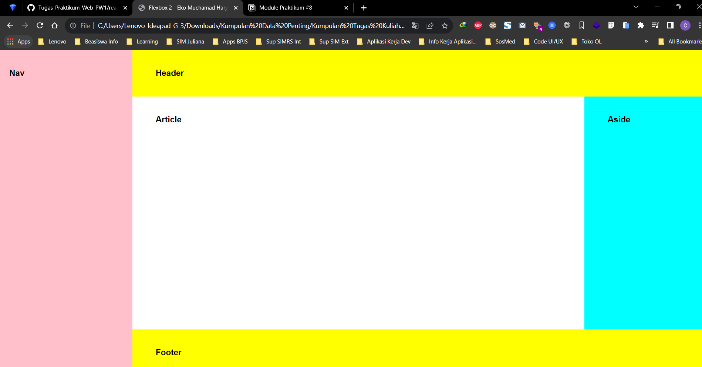 

      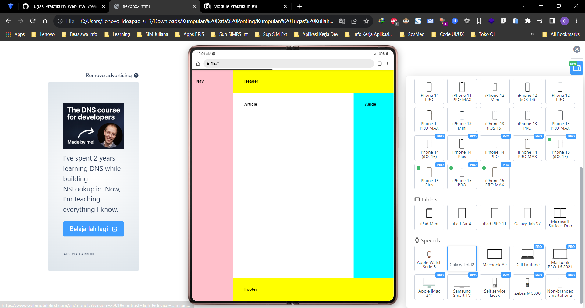 

<b>7. Nama Folder : Praktikum_11 :</b>

<h3>Tugas Utama Praktikum 11 : </h3>

Lokasi Praktikum 11 = Directory Repo = <a href="https://github.com/ekomh170/Tugas_Praktikum_Web_PW1/tree/ry_dev/Praktikum_11">Praktikum_11/</a>

- Praktikum 11 | <b>Menghitung Jumlah Dua Bilangan</b> = Lokasi = <a href="https://github.com/ekomh170/Tugas_Praktikum_Web_PW1/blob/ry_dev/Praktikum_11/tugas/menghitung_jumlah_dua_bilangan.html">Praktikum_11/tugas/menghitung_jumlah_dua_bilangan.html</a>
  
1. Hasil Output Tugas : 

      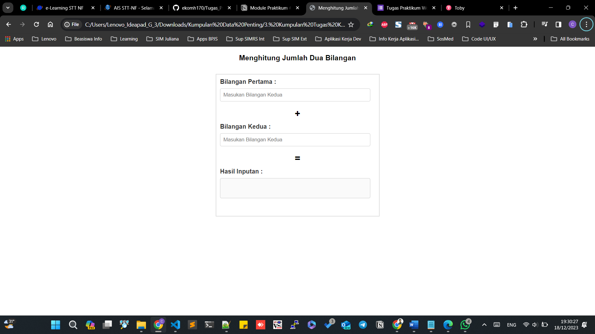 

<b>7. Nama Folder : Praktikum_12 :</b>

<h3>Tugas Utama Praktikum 12 : </h3>

Lokasi Praktikum 12 = Directory Repo = <a href="https://github.com/ekomh170/Tugas_Praktikum_Web_PW1/tree/ry_dev/Praktikum_12">Praktikum_12/</a>

- Praktikum 12 | <b>Membuat Form Validation - Menggunakan Javascript (JS)</b> = Lokasi = <a href="https://github.com/ekomh170/Tugas_Praktikum_Web_PW1/tree/ry_dev/Praktikum_12/Tugas_12/1_Form_Validation">Praktikum_12/Tugas_12/1_Form_Validation/form_validation.html</a>
  
1. Hasil Output Tugas : 

      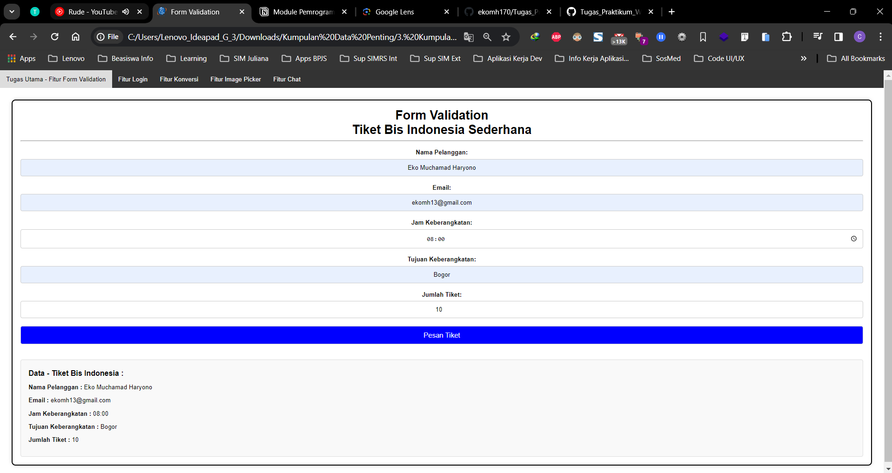 

      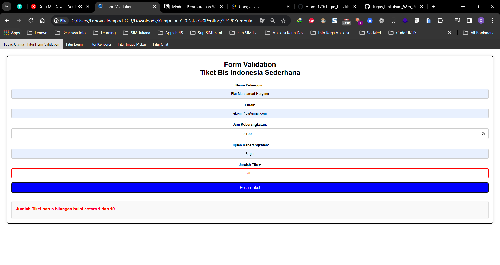 

      